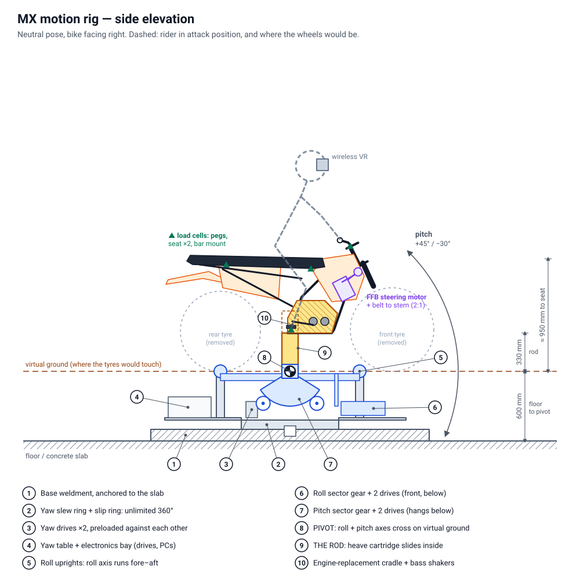

# MX Motion Rig

A full-motion motocross simulator you can **whip, scrub, wheelie, and back into a turn sideways**.

It's a real MX frame on **one steel rod**. The bottom of the rod sits in a powered "ball joint" (a 3-axis gimbal) that **spins 360° flat without limit, leans ±60° and pitches +45° / −30°**. The rod itself telescopes 200 mm, which works as the suspension. On top you get a **force-feedback steering head**, the bike's **real controls**, **load cells that read your body** so you have to physically pull a wheelie back in, and **wireless VR**.



## Headline spec

| | |
|---|---|
| **Yaw** | Unlimited 360°, 180°/s; heading 1:1 with the bike, so every turn physically turns you |
| **Roll** | ±60° (real peg-drag angle), 150°/s, pivoting on the virtual ground like a real bike |
| **Pitch** | +45° wheelie / −30° nose-down, 120°/s |
| **Heave** | ±100 mm along the bike's own axis, 1.5 g landing onset |
| **Steering FFB** | Up to ~64 N·m at the bars through the real triple clamps, ±40° lock |
| **Controls** | Real throttle, clutch, front/rear brake (real calipers as pressure sensors), shifter |
| **Body sensing** | Load cells in pegs, seat and bar mounts, plus VR head pose → rider centre of mass to the game |
| **Payload** | **300 kg on the rod**: rider up to 130 kg in gear + bike up to 170 kg, so a complete 450 fits ([engine in or out?](docs/DESIGN.md#engine-in-or-out)) |
| **Space** | 5 × 5 m fenced cell, 3.0 m ceiling, 400 V 3-phase 32 A |
| **Budget** | Roughly $29k–80k USD depending on new vs used parts ([BOM](docs/BOM.md)) |

## Documents

- **[docs/DESIGN.md](docs/DESIGN.md)**: the full design: requirements, concept, every subsystem, control architecture, mod interface, safety, build order.
- **[docs/BOM.md](docs/BOM.md)**: parts list and ballpark budget.
- **[docs/SIZING.md](docs/SIZING.md)**: torque, inertia, envelope and safety numbers for the rated case, the engine-in layout and the engine-out build (generated).
- **[docs/img/](docs/img)**: side and front elevations.

## Tools

The numbers and drawings come from code, so they stay consistent when you change something:

```sh
python3 tools/rig_sizing.py                              # rated case: 300 kg on the rod
python3 tools/rig_sizing.py --rider 90 --bike 77         # engine-out bike, lighter rider
python3 tools/rig_sizing.py --pivot-drop 0.2 --gimbal-servo 7.5   # engine-in layout
python3 tools/make_diagrams.py            # regenerate docs/img/*.svg
```

Both need only Python 3 (no packages).

## Scope

This repo covers the **physical machine** and the signal contract with the game. Writing the game mod itself (feeding the rider's body inputs into the bike physics) is a separate job; [DESIGN.md §6](docs/DESIGN.md#6-interface-to-the-game-mod) defines what it has to send and receive.
