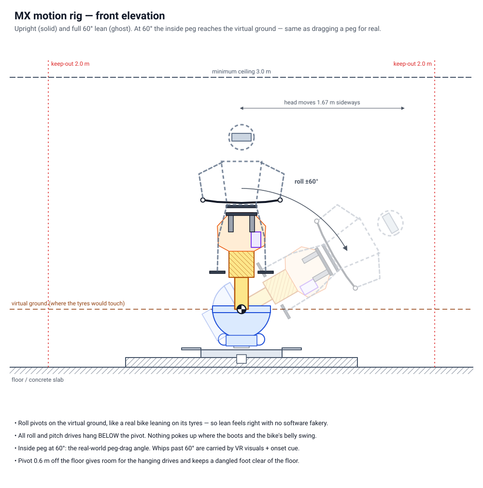
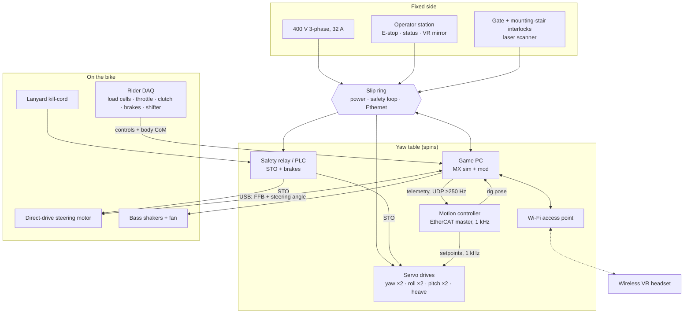

# MX Motion Rig: Design Specification

A full-motion motocross simulator you can whip, scrub, wheelie and back into a turn sideways. It's one steel rod under a real MX frame, standing on a powered "ball joint" that spins 360° flat and tilts any direction. On top of that: a force-feedback steering head, the bike's real controls, sensors that read your body, and VR.

**Status:** concept design v0.1. Sized and laid out, not yet CAD'd against a specific donor frame.
Numbers marked † come from [`tools/rig_sizing.py`](../tools/rig_sizing.py) (full output in [SIZING.md](SIZING.md)).

---

## 1. What it has to do

A superbike sim can get away with a rig that just leans. Motocross can't. These are the moves the rig is built around:

| Move | What the real bike does | What the rig must do |
|---|---|---|
| **Whip** | In the air, bike laid sideways 45–90°, pulled back straight before landing | Roll hard to ±60° with yaw, and back, in under a second |
| **Scrub** | Bike laid over low across the jump face | Roll, yaw and pitch together at take-off |
| **Oppo / backing it in** | Rear steps out; the bike points one way and travels another; you counter-steer | Yaw the whole rider to the slide angle; the bars pull into the slide |
| **Wheelie** | Front lifts 20–45°+ and *you* have to bring it back down | Pitch nose-up to 45°, the bars go light, and you bring it down with your body and the rear brake |
| **Landings, cases, whoops** | 300 mm of suspension slams through | A kick along the bike's own vertical axis, plus a thump |
| **Berms and ruts** | 45–55° of lean; the front tucks and grabs | Lean pivoting at the ground; steering torque that fights you |
| **Engine, roost, terrain** | Vibration | Bass shakers |

### Motion envelope (design targets)

| Axis | Range | Peak speed | Peak accel | Why |
|---|---|---|---|---|
| **Yaw** | unlimited 360° | 180°/s | 400°/s² (200 at full lean) | 1:1 heading, so every turn on the track physically turns you; oppo slides; flat 360s |
| **Roll** | ±60° | 150°/s | 500°/s² | Berms down to peg-drag; whips; scrubs |
| **Pitch** | +45° / −30° | 120°/s | 400°/s² | Wheelies, jump faces, nose-down landings |
| **Heave** | ±100 mm along the rod | 0.6 m/s | 1.5 g onset | Landings, whoops, suspension compression |
| **Steering** | ±40° (the bike's own stops) | n/a | 50–64 N·m at the bars | Ruts, self-steer, headshake, light front in the air |

Design rider: **110 kg in gear, standing in the attack position** (the worst case: highest centre of mass).

**Why ±60° roll and not 90°.** 60° is peg-drag on a real bike, the furthest you can lean on the ground. Whips go further, but only in the air. There the rig snaps to 60° hard and fast, and the VR picture shows the rest. Your inner ear reads the *onset* of a rotation far more than its final angle, so a violent 60° feels like a big whip. Going past 60° with a rider who is standing and unstrapped would throw people off.

---

## 2. The concept: your rod, made buildable

What you described:

> A single rod of steel that bolts to the bottom of a dirt-bike frame. The other end goes into a motor unit that can move the bike 360° flat, and hinge it forward, back and sideways. Like a big ball joint.

That *is* the design. Here's what each part of it becomes in hardware:

- **"Gyroscopic motor" / "big ball" → a powered 3-axis gimbal.** It's three rotary axes stacked like the rings of a gyroscope mount: **yaw** (spin flat) on a big slewing ring at the bottom, then **roll**, then **pitch**. The roll and pitch axes cross at one point, the **pivot**, so the rod moves exactly as if it sat on a ball joint, except every direction is driven. You can't buy a motorised ball that carries 400 kg at 4 kN·m, but you can build a gimbal that behaves the same way.
- **"Two ball joints" → one powered joint at the bottom, one rigid joint at the top.** The rod's top end bolts *solid* to the frame. Any slop there and the bike would wobble on its own, and the feel would be gone.
- **The rod also slides (heave).** The rod is a telescope. The bottom half is fixed to the gimbal; the top half carries the bike and slides 200 mm up and down it on linear rails, driven by a ball screw. That's your suspension: a landing punches you down along the bike's own axis, which is exactly the direction real forks and shocks compress.
- **VR, not a screen.** A screen can't follow you through a 360° spin or a 60° whip. Use a headset, and a wireless one, because nothing can be wired across unlimited yaw.

### Where the pivot goes (the key decision)

The pivot sits on the **virtual ground**, the line where the tyres would touch the dirt. A real bike leans by rolling over on its tyre contact patches, which swings the rider's head out in a big arc. With the pivot on the virtual ground the rig leans the same way, about the same point, so your body moves through the same arc. At 60° the inside footpeg reaches the virtual ground, which is exactly where pegs drag in real life.

So the rod is **≈330 mm** from pivot to frame (typical MX ground clearance), and the pivot is **600 mm** off the floor to leave room for the drives below it.

*Trade-off to know about:* in the air, a real bike rotates about its own centre of mass, about a metre higher. On the rig, airborne rotations still pivot at the ground, so a fast whip gives your hips a small sideways shove that a real whip wouldn't. The motion software can trim this. It's the price of the single-rod layout, and in return the rig gets ground riding (90% of a lap) exactly right.

### Everything hangs below the pivot

At full lean the inside boot dips just below pivot height, about 0.45 m out to the side. At a full wheelie your heels come down to about 0.13 m above the pivot, just behind it. Nose-down, the bike's belly comes within about 0.14 m in front. Anything that sticks up near the pivot gets kicked.

**Rule: above the pivot plane, nothing but the rod within 0.75 m.** Roll and pitch are driven by big **sector gears** (pie-slice gears) hanging *under* the pivot, with their motors lower still. Bonus: about 100 kg of hanging drives and gears acts as a counterweight, which cuts the overturning torque the motors fight by about 15%.

### Options considered and dropped

| Option | Why not |
|---|---|
| A literal driven ball (sphere on omni-wheels) | Friction drives slip at these torques and can't hold a 4 kN·m lean |
| Linear actuators under the bike (car-sim style) | Tops out at ±25–30°, the geometry falls apart at whip angles, and there's no continuous yaw |
| Hexapod (Stewart platform) | Same angle limit, expensive, no 360° |
| Second-hand industrial robot, 500 kg class (as used on some robot-arm rides) | Proven, but no unlimited yaw, huge, and hard to make safe as a DIY build. Kept as a fallback idea |
| Gimbal rings around the rider (pivot at your centre of mass) | Better in the air, wrong for leaning on the ground, and not your concept |
| Robot-style reducers on the axes | The bearing housings stick up exactly where your boots go at full lean or full wheelie |

---

## 3. Mechanical design, bottom up

Coordinates: origin at the pivot, **x** forward, **y** left, **z** up.

### 3.1 Base

- Steel weldment, X-shaped, 2.4 m tip to tip. Arms in 200×100 RHS; 30 mm centre plate machined flat for the slewing ring.
- Bolted to a reinforced slab at least 150 mm thick with 8× M16 chemical anchors. Design overturning moment **5.8 kN·m**†. If you can't anchor it, ballast it and widen it, but anchor it if at all possible.
- Shim and grout under the centre plate until the slewing-ring seat is as flat as the ring maker specifies (typically ≤0.1 mm).

### 3.2 Yaw: unlimited spin

- **Slewing ring:** 4-point-contact ball type, ~800 mm bore class, external gear teeth, outer ring bolted to the base. The large bore lets the hanging roll and pitch drives swing through its open centre.
- **Yaw table:** an open ring frame bolted to the rotating ring. It carries the roll uprights, the roll drives and the electronics bay.
- **Drives:** 2× (2 kW servo + 10:1 planetary + pinion) at rear-left and rear-right, 80:1 overall. The two are **preloaded against each other** electronically (one drives, the other holds back slightly), which gives zero backlash: no clunk when yaw reverses in an oppo flick. Peak **1.2 kN·m**†.
- **Slip ring** in the centre under the table: 3-phase + N + 2× PE at 32 A, two channels for the hard-wired safety loop, Gigabit Ethernet (or a fibre rotary joint), and spares. Everything else lives on the yaw table, so nothing else has to cross the rotation.
- Absolute encoder on the ring for homing.

### 3.3 Roll: outer axis

- The roll axis runs fore–aft through the pivot, carried by two short uprights at x = ±0.60 m. Use compact bearings whose housings stay **≤80 mm above the pivot**.
- **Roll ring:** a rectangular open frame (side members at y = ±0.25 m), open in the middle so the rod and the pitch sector can swing through it.
- **Drive:** a steel sector gear (pitch radius 0.30 m, spans ±90°, case-hardened, module ~8, 60 mm face) at x = +0.40 m, hanging below the axis. Two pinions sit at ±30° from the bottom, each driven by a 5 kW servo + 20:1 planetary; 100:1 overall, preloaded pair. Peak **3.9 kN·m**†; tooth force **16 kN**† (confirm with a proper gear-strength calc).
- **Why roll is the outer axis:** it's the big-range axis, and putting its bearings fore and aft (not at the sides) keeps them clear of your boots at full lean.
- **Why its drive is at the front:** at a full wheelie your heels come down *behind* the pivot. Nose-down is limited to −30°, so the front has more room.

### 3.4 Pitch: inner axis

- The pitch hub sits at the pivot, with trunnions out to the roll ring's side members. The rod bolts on top.
- **Drive:** a sector gear hanging under the hub in the fore–aft plane, with two 5 kW pinion drives mounted on the roll ring (they roll with it). 100:1. Peak **3.4 kN·m**†.

### 3.5 The rod and heave cartridge

The rod is a telescope, and the engine bay houses it. **The rod takes the engine's place.**

- **Sleeve (fixed to the pitch hub):** ~160×160×8 square tube, about 520 mm tall, rising from the hub through the underside of the frame into the engine bay. Two size-35 profile rails run on its front and rear faces. Bending stress at peak torque is about 60 MPa†, a safety factor of ~6 on S355 steel.
- **Carriage (moves):** the engine-replacement cradle (§3.6) carries four rail carriages, and the bike rides on it.
- **Actuator:** 10 kN ball-screw electric cylinder, 20 mm lead, 3 kW servo, mounted inside the sleeve. Peak **5.3 kN**†, 0.6 m/s, 200 mm stroke.
- **Static support:** an adjustable air spring in parallel, with pressure set to the rider's weight, so the servo handles only the dynamics and isn't holding you up all session. It still works without one; the motor just runs warm.
- **Bump stops:** polyurethane at both ends of travel. That's your bottoming-out.

### 3.6 The bike

You're in VR, so you never see the real bike. Only touch matters. Keep everything you touch and cut everything else: less moving mass means harder-hitting motion.

| Keep | Remove |
|---|---|
| Frame, subframe, seat, tank shell, radiator shrouds (knee grip), side panels | Engine, wheels, swingarm, shock, exhaust, radiators, airbox internals, fuel |
| Footpegs, shift lever, rear brake pedal + master cylinder | Fork legs below the lower clamp (cut to ~150 mm stubs), front fender |
| Bars, clamps, triple clamps, levers, front master cylinder, throttle housing, grips | Brake discs and calipers, which come back as sensors (§3.8) |
| Steering-head bearings and the steering stops | |

**Donor:** any modern 250/450 MX frame. Non-runners and seized-engine bikes are cheap. On **steel frames** (KTM, Husqvarna, GasGas) you can weld tabs. On **aluminium frames** (Honda, Yamaha, Kawasaki, Suzuki) bolt only, never weld.

**Engine-replacement cradle.** A fabricated steel box (~14 kg) that bolts to *every* engine mount the frame has: front/downtube, lower, upper/head-stay, and through the swingarm pivot bolt. On aluminium frames the engine is a stressed member, so the cradle takes over that job. Those mounts are built to carry a rider landing big jumps; the rig's loads are a fraction of that. Loading through the engine mounts is safe. Clamping to frame tubes is not.

### 3.7 Force-feedback handlebar

- **Motor:** a 25–32 N·m direct-drive servo. Sim-racing direct-drive wheel bases suit this well: USB, a force-feedback stack, a high-resolution encoder and a safety input are already built in. It goes in the left radiator space, with its axis parallel to the steering axis.
- **Drive:** a 2:1 toothed belt (HTD/GT profile, tensioned, no backlash) to a pulley clamped under the lower triple clamp, concentric with the stem. That gives **50–64 N·m at the bars**.
- **Range:** the bike's own steering stops (~±40°), with software end-stops a few degrees inside them.
- **What you feel:**
  - the front tyre self-aligning, with the bars pulling toward where the bike is falling
  - ruts grabbing the front, and kicks from rocks and roots
  - headshake and tank-slappers (5–10 Hz)
  - the front going light in a wheelie or in the air, then coming back hard on touchdown
  - the bars pulling *into* an oppo slide, so you have to counter-steer
- **Strength:** a rider can overpower about 60 N·m on 800 mm bars, as on a real bike. Past about 80 N·m it starts to risk your wrists.

### 3.8 Controls: real parts, real feel

| Control | How | Sensor |
|---|---|---|
| Throttle | Real tube and housing; the real cable runs to a pulley box under the tank with the stock return spring | Contactless magnetic angle sensor |
| Clutch | Cable type: a spring pack matched to real pull. Hydraulic: the real slave on a spring pack | Magnetic linear sensor |
| Front brake | Real master cylinder → real caliper clamped onto a short steel disc segment, so lever feel is identical | 0–100 bar pressure transducer on a banjo T |
| Rear brake | Real pedal and master cylinder, same trick | Pressure transducer |
| Gear shift | Real lever on a stub shaft with a sprung detent (the click) and a return spring | 2 Hall switches (up/down) |
| Kill button | Real button | Game input (stall) plus a "pause and level" request |
| **Boots** | Wear real MX boots | They're half the feel of the pegs, shifter and brake |

### 3.9 Rider sensing: how you "pull it back in"

This is what makes it riding instead of a ride. The rig moves the bike; the sensors read your body so the game physics knows what you're doing.

| Sensor | Where | Tells the game |
|---|---|---|
| Load cell ×2 (300 kg rated) | Under each footpeg | Left/right weighting, standing weight, peg-weighting in turns |
| Load cell ×2 | Seat front and rear mounts | Sitting vs standing; how far back you are |
| Load cells ×2–4 | Under the bar risers | Pulling or pushing on the bars; weight on the front |
| VR headset pose | Relative to the bike, after motion compensation | Where your head and upper body are: back, over the front, off the side |

From these the rider DAQ computes your centre of mass relative to the bike at ~500 Hz and sends it to the game mod. The rig's own motion also pushes on the load cells (accelerating you sideways loads one peg), so the DAQ subtracts that using the rig's measured acceleration, leaving only your input.

**Wheelie, start to finish:**
1. Throttle and clutch → the sim lifts the front → the rig pitches you back.
2. The bars go light, and gravity pulls you backward the way acceleration would.
3. To bring it down you do what you'd do on a real bike: get your weight forward over the bars (the peg and bar load cells see it), roll off, and tap the rear brake (the pressure sensor sees it).
4. The physics drops the front → the rig pitches down → the front lands and the bars come alive.

If you don't do step 3, it loops out. The sim decides.

**Whip:** off the lip, you push the bars and kick the back out with your hips and the outside peg. The load cells and bar torque feed the sim, which rotates the bike, and the rig rolls and yaws to follow. You pull it back with the bars and your body before landing.

### 3.10 Tactile and extras

- **Bass shakers** (tactile transducers): two on the cradle and one under the seat, for engine RPM, roost, landings and terrain texture. They're driven by an amp fed from telemetry, and cover everything above ~10 Hz that the big axes can't.
- **Fan** on the number-plate area, so it rotates with you, with speed proportional to ground speed. It's cheap and greatly reduces VR sickness.

---

## 4. Sizing summary †

| | Roll | Pitch | Yaw | Heave | Steering |
|---|---|---|---|---|---|
| Peak demand | 3.9 kN·m | 3.4 kN·m | 1.2 kN·m | 5.3 kN | ≤64 N·m |
| Drive | Sector + 2× 5 kW | Sector + 2× 5 kW | Slew ring + 2× 2 kW | Ball screw + 3 kW + air spring | 32 N·m DD + 2:1 belt |
| Overall ratio | 100:1 | 100:1 | 80:1 | 20 mm lead | 2:1 |
| Motor speed at max rate | 2500 rpm | 2000 rpm | 2400 rpm | 1800 rpm | — |
| Peak motor torque needed (incl. 1.25× margin) | 28 N·m of 48 | 25 N·m of 48 | 13 N·m of 19 | 23 N·m of 29 | — |

- **Moving mass:** ~400 kg rolls (rider + bike + rod + inner gimbal). The whole machine is about 1 tonne.
- **Space:** keep-out radius **2.0 m**, so plan a fenced cell of about 5 × 5 m. Minimum ceiling **3.0 m**. The seat is about 1.55 m off the floor, so you'll need a mounting step.
- **Power:** 400 V 3-phase, 32 A supply recommended. About 28 kW of servo is installed, but the average draw is a few kW. Put all drives on a common DC bus with a braking resistor, because letting a lean down regenerates. 230 V single-phase at 32 A can work with a DC-bus capacitor bank and derated peaks, but it isn't recommended.

---

## 5. Electrical and control

- **Everything that yaws lives on the yaw table:** servo drives, motion controller, game PC, safety relay/PLC and Wi-Fi access point. Only power, the safety loop and one network link cross the slip ring.
- **Motion controller:** real-time, EtherCAT master, sending cyclic position setpoints at 1 kHz to the 7 motion drives. It runs the motion cueing, the kinematics, the limits and the rider-departure logic.
- **Kinematics:** the gimbal order is yaw → roll → pitch. The game reports heading/pitch/roll, and the controller converts with a closed-form solution. There are no singularities inside ±60° / +45°.
- **Steering FFB** goes straight from the game PC to the direct-drive base over USB, the shortest-latency path.
- **Latency targets:** game physics → rig motion < 20 ms; FFB < 5 ms. If motion lags the VR picture by more than ~50 ms, motion sickness follows quickly.
- **VR motion compensation is mandatory.** The headset feels the rig move and would otherwise move your view twice. Feed the rig's encoder pose to an OpenXR motion-compensation layer as a virtual tracker (best, no extra hardware), or strap a tracker to the frame.

---

## 6. Interface to the game mod

You said the mod is a separate job, so this section only covers what has to cross the boundary.

| Game → rig (UDP, ≥250 Hz, ideally every physics step) | Rig → game |
|---|---|
| Bike heading, pitch, roll | Steering angle (the DD base appears as a standard wheel axis) |
| Angular rates; linear acceleration in the bike frame | Throttle, clutch, front and rear brake pressure, shift up/down, kill (USB HID) |
| Fork and shock travel and velocity | **Rider centre of mass (x, y, z in the bike frame), peg loads L/R, seat load, bar push/pull** (UDP) |
| Front/rear wheel contact, surface type, rear slip, RPM, gear | Rig actual pose (also used by VR compensation) |
| Events: landing impact, crash, reset/teleport | Rig state: armed / limited / stopping |

Sims with a telemetry plugin interface (MX Bikes has one) can already supply most of the left column. The bold row on the right, your body, is what the mod has to feed into the physics so that weight shifts change what the bike does.

---

## 7. How each move plays out on the rig

| Move | Rig | You |
|---|---|---|
| **Whip** | Rolls toward 60° and yaws, fast; VR shows the full lay-down | Bars + hips + outside peg throw it; you pull it back before the landing |
| **Scrub** | Roll, yaw and nose-down together off the lip | Same inputs, lower and earlier |
| **Oppo** | Yaws you to the slide angle (heading is 1:1); bars pull into the slide | Counter-steer, feather the clutch, weight the outside peg |
| **Wheelie** | Pitches up to 45°; bars go light; gravity pulls you back | Weight forward, roll off, tap the rear brake |
| **Landing / case** | Heave drops with a 1.5 g onset, pitch snaps, shakers thump | Absorb it with your legs |
| **Berm** | Leans you up to 60°, pivoting at the ground like a real bike | Inside leg out, weight the outside peg |
| **Rut** | FFB locks the bars into the rut line; small corrections kick | Commit, look through |
| **Tank-slapper** | 5–10 Hz bar oscillation | Grip, get on the gas |
| **Crash** | **Does not follow.** A short soft cue, then back to level over ~2 s | Stay on |

---

## 8. Safety

This machine can move a person 1.7 m sideways in under half a second. Treat it like industrial machinery, because it is.

| Hazard | Answer |
|---|---|
| **Thrown off** | Acceleration and jerk caps a rider can hold (start at 30% gain and work up). **Rider-departure detection:** if seat + peg + bar load drops below 30% of body weight for 0.1 s while armed → controlled stop to level. **Lanyard kill-cord** clipped to your belt. |
| **Bystander hit** (2 m swing radius) | Fenced 5 × 5 m cell with an interlocked gate and a laser scanner or light curtain on the gate side. The rig won't arm unless the gate is shut and the mounting stair is parked in its dock. |
| **Fingers or feet in gears** | All sector gears, pinions and the slew-ring teeth under bolted guards, plus a flexible skirt around the gimbal. |
| **Runaway axis** (software or drive fault) | Soft limits in the controller; hard-wired limit switches at ±62° → STO; polyurethane buffers from ±63° with 10° of crush, sized for **920 J / 5.3 kN·m**† (worst case: roll at full speed). Pitch gets the same treatment. |
| **Power cut at full lean** | Every motor has a spring-applied holding brake, so the rig freezes in place. A manual brake release plus a hand-wheel lowers it gently, and the hanging drives take some of the load. A UPS keeps the controller and safety PLC alive to log and display state. |
| **Crash in the game** | The rig doesn't follow the crash (§7). |
| **400 V on a spinning machine** | Double PE through the slip ring, RCD protection, IP54+ enclosures, and drives in a locked bay on the yaw table. |
| **Motion sickness** | Motion < 20 ms behind the picture, 1:1 yaw, the fan, and short first sessions. |
| **Structural failure** | Proof-load the rod and cradle to 1.5× peak before the first ride; first natural frequency > 25 Hz (check in FEA); inspect welds and bolts on a schedule. |

**E-stop behaviour:** the operator E-stop and the lanyard trigger a *controlled* stop (decelerate toward level within ~1 s, then cut torque and apply the brakes). Hard faults (limit switch, drive fault, watchdog) cut torque and apply the brakes immediately.

**No overhead harness.** It seems like the obvious safety line, but a ceiling tether to your chest has to pay out at **3.6 m/s**† during an ordinary whip. Self-retracting lifelines lock at about 1.5 m/s, so one would yank you mid-whip. The protection is everything in the table above, plus padded mats inside the cell.

**Standards.** For a personal build, use ISO 12100 for the risk assessment and ISO 13849-1 for the safety functions (aim for PL d on E-stop and STO). If anyone else will ride it, especially for money, it becomes an amusement device under ride standards (ISO 17842 / EN 13814 / ASTM F2291 / AS 3533, depending on where you are). Get an engineer to sign it off.

---

## 9. Build order

1. **CAD + calcs:** model your actual donor frame. Check the clearance rule in §2 through the whole envelope with a boot model. Run FEA on the rod, cradle and yaw table (first mode > 25 Hz), and gear-strength calcs for the sectors.
2. **Static bike first:** strip the bike, fit the cradle on a fixed stand, add the controls, DAQ, FFB and VR. Get the mod reading your body and driving the bars. You can ride it static, and this proves the inputs before the big motion spend.
3. **Base + yaw:** anchor it, then commission yaw and the slip ring alone.
4. **Gimbal, empty:** limits, switches, E-stops, STO, brakes and power-cut behaviour, with no payload.
5. **Gimbal + dummy rider:** bolt on about 200 kg (steel plates on a post at the rider's CoM height, 1.35 m). Run the full envelope, step responses, and a power cut at full lean. Proof-load the rod and cradle at 1.5×.
6. **Heave cartridge, shakers, fan.**
7. **First human:** 25% gain with an operator on the E-stop, raising gains over sessions.

Parts list and budget: [BOM.md](BOM.md).

---

## 10. Open items (confirm in CAD with the real frame)

- Room in the engine bay for the heave cartridge and cradle on your specific frame; where the lower frame rails sit relative to the sleeve.
- The no-go zone (§2) checked against real plastics, boots and a dangled leg.
- FFB motor and belt routing on that frame.
- Slip ring part choice; 3-phase rating vs the installed drive power.
- Sector gear module and face width from a proper gear calculation.
- Structural first mode > 25 Hz; stiffness of the rod-to-cradle joint (8× M12 10.9 + spigot is the starting point).
- Whether the hip shove during whips (§2) needs a software fix.
